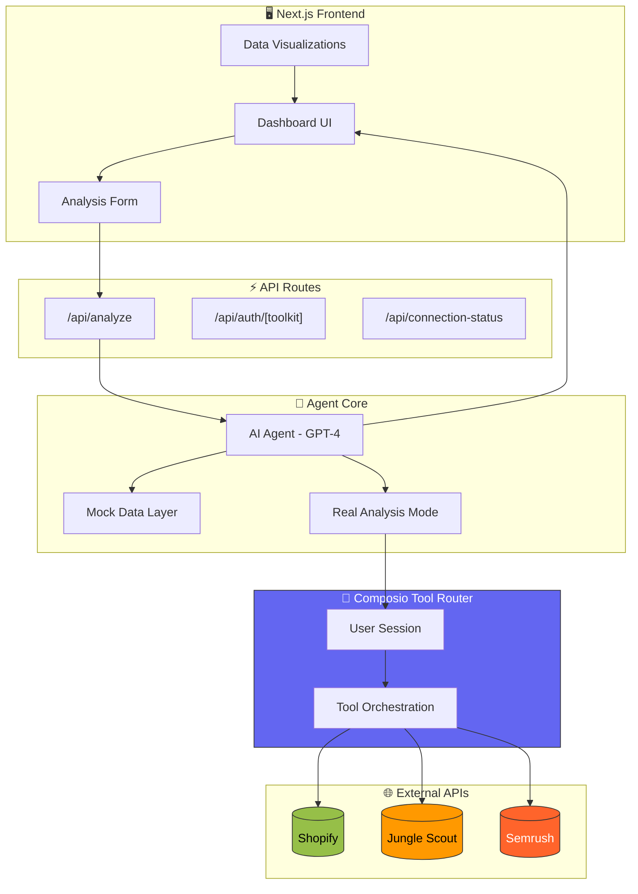
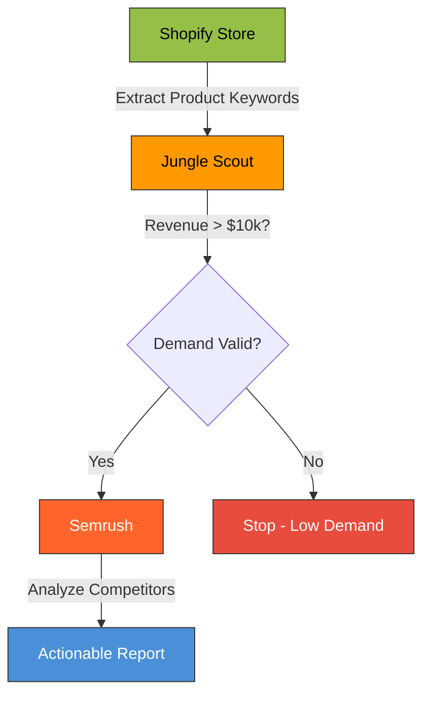

# 🛒 Shopify Competitive Intelligence AI Agent

> **Data-driven product research powered by Composio, Jungle Scout, and Semrush**

An AI-powered competitive analysis agent that transforms your Shopify store into a strategic research hub. Validate product demand, discover real competitors, and get actionable traffic insights, all from a single interface.

---


## 🎯 Overview

This agent follows a structured **validate-then-analyze** workflow that mimics how successful e-commerce entrepreneurs research products:

1. **Extract Keywords** – Uses your Shopify product catalog as the knowledge base
2. **Validate Demand** – Checks Amazon sales data via Jungle Scout before deep-diving
3. **Find Competitors** – Discovers real DTC stores ranking for your keywords via Semrush
4. **Generate Insights** – Provides actionable recommendations on traffic strategy

### Why This Workflow?

| Step | Tool | Purpose |
|------|------|---------|
| 🏪 Knowledge | **Shopify** | Extract "seed" keywords from your product catalog |
| ✅ Validation | **Jungle Scout** | Prove demand exists (revenue >$10k/mo threshold) |
| 🔍 Intelligence | **Semrush** | Find real competitors & their traffic sources |

---

## 🏗 Architecture



### Agent Decision Flow



---

## 🛠️ Tech Stack

| Category | Technology |
|----------|------------|
| **Framework** | Next.js 14.1 (App Router) |
| **Language** | TypeScript 5 |
| **AI/LLM** | OpenAI GPT-4 Turbo via Vercel AI SDK |
| **Tool Orchestration** | Composio Core + Vercel Provider |
| **Styling** | Tailwind CSS + Framer Motion |
| **Charts** | Recharts |
| **UI Components** | Radix UI + Custom Components |


---

## 🔧 How Composio is Used

Composio with **Tool Router** orchestrates all external API calls. It provides a unified interface to connect, authenticate, and execute tools across multiple services.


## 📁 Project Structure

```
shopify-helper-agent/
├── src/
│   ├── app/
│   │   ├── api/
│   │   │   ├── analyze/route.ts       # Product analysis endpoint
│   │   │   ├── auth/[toolkit]/route.ts # OAuth URL generation
│   │   │   └── connection-status/route.ts # Check toolkit connections
│   │   ├── globals.css                # Global styles
│   │   ├── layout.tsx                 # Root layout
│   │   └── page.tsx                   # Main dashboard page
│   ├── components/
│   │   ├── AnalysisForm.tsx          # Product input form
│   │   ├── CompetitorCard.tsx        # Competitor display card
│   │   ├── DashboardCharts.tsx       # Revenue & traffic charts
│   │   ├── DemandIndicator.tsx       # Demand score visualization
│   │   ├── ResultsDashboard.tsx      # Main results display
│   │   └── ui/                       # Reusable UI components
│   └── lib/
│       ├── agent.ts                  # AI agent logic & prompts
│       ├── auth.ts                   # Composio auth helpers
│       ├── composio.ts               # Composio SDK initialization
│       ├── mock-data.ts              # Mock data for MVP phase
│       └── utils.ts                  # Utility functions
├── .env.example                      # Environment variables template
├── package.json
├── tailwind.config.ts
└── tsconfig.json
```

---

## 🚀 Setup & Installation

### Prerequisites

- Node.js 18+ 
- npm or yarn
- OpenAI API key
- Composio API key ([Get one here](https://composio.dev))

### 1. Clone & Install

```bash
git clone <repository-url>
cd shopify-helper-agent
npm install
```

### 2. Configure Environment

```bash
cp .env.example .env
```

Edit `.env` with your credentials:

```env
# Composio - Tool Router
COMPOSIO_API_KEY=your_composio_api_key

# OpenAI - Agent LLM
OPENAI_API_KEY=your_openai_api_key

# App URL (for OAuth callbacks)
NEXT_PUBLIC_APP_URL=http://localhost:3000

# User ID (for demo/MVP)
DEFAULT_USER_ID=shopify_demo_user
```

### 3. Connect Toolkits 

```bash
# Install Composio CLI
pip install composio-core composio-openai

# Authenticate toolkits
composio add shopify
composio add junglescout
composio add semrush
```

### 4. Run Development Server

```bash
npm run dev
```

Visit [http://localhost:3000](http://localhost:3000)

---

## 📖 Usage

### Basic Analysis (Mock Mode)

1. Open the website
2. Enter a product name in the input field:
   - Try: `Clay Mask`, `Snail Mucin`, `Beetroot Scrub`
3. Click **Analyze**
4. View the results dashboard with:
   - Demand Score & Trend
   - Revenue Estimate
   - Competitor Cards
   - Traffic Distribution Chart
   - Strategic Recommendation

### Sample Products for Demo

| Product | Expected Result |
|---------|-----------------|
| **Clay Mask** | ✅ High demand ($52k/mo), focus on Google Ads |
| **Snail Mucin** | 🔥 Explosive trend (+200% YoY), huge branding opportunity |
| **Beetroot Scrub** | ❌ Low demand, recommend pivoting |


---

## 🤝 Contributing

1. Fork the repository
2. Create a feature branch: `git checkout -b feature/amazing-feature`
3. Commit changes: `git commit -m 'Add amazing feature'`
4. Push to branch: `git push origin feature/amazing-feature`
5. Open a Pull Request

---

## 📄 License

MIT License - see [LICENSE](LICENSE) for details.

---

<p align="center">
  <strong>Built with ❤️ using Composio</strong><br>
  <sub>Powered by Jungle Scout • Semrush • OpenAI</sub>
</p>
