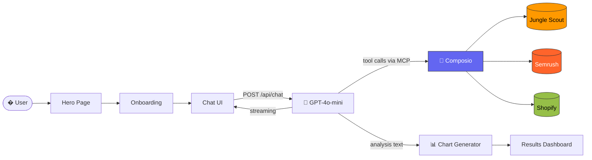
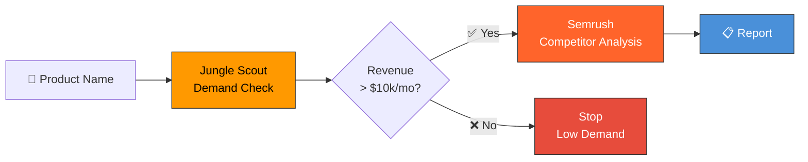

# 🛒 Shopify Competitive Intelligence AI Agent

> **Data-driven product research powered by Composio, Jungle Scout, and Semrush**

An AI-powered competitive analysis agent that transforms your Shopify store into a strategic research hub. Validate product demand, discover real competitors, and get actionable traffic insights — all through a conversational chat interface.

---


## 🎯 Overview

This agent follows a structured **validate-then-analyze** workflow that mimics how successful e-commerce entrepreneurs research products:

1. **Extract Keywords** – Uses your product name as the seed keyword
2. **Validate Demand** – Checks Amazon sales data via Jungle Scout before deep-diving
3. **Find Competitors** – Discovers real DTC stores ranking for your keywords via Semrush
4. **Generate Insights** – Provides actionable recommendations on traffic strategy

### Why This Workflow?

| Step | Tool | Purpose |
|------|------|---------|
| 🏪 Knowledge | **Shopify** | Extract "seed" keywords from your product catalog |
| ✅ Validation | **Jungle Scout** | Prove demand exists (revenue >$10k/mo threshold) |
| 🔍 Intelligence | **Semrush** | Find real competitors & their traffic sources |

---

## 🏗 Architecture

### System Overview



### Agent Decision Flow



---

## 🛠️ Tech Stack

| Category | Technology |
|----------|------------|
| **Framework** | Next.js 14.1 (App Router) |
| **Language** | TypeScript 5 |
| **AI/LLM** | OpenAI GPT-4o-mini via Vercel AI SDK (`ai` v6) |
| **Tool Orchestration** | Composio Core (`@composio/core`) + AI SDK MCP Client (`@ai-sdk/mcp`) |
| **Styling** | Tailwind CSS + Framer Motion |
| **Charts** | Recharts |
| **UI Components** | Radix UI + shadcn/ui + Lucide Icons |
| **3D/Visual** | Three.js + ShaderGradient |
| **Validation** | Zod |
| **Testing** | Vitest + Testing Library |


---

## 🔧 How Composio is Used

Composio acts as a **universal tool gateway** via the **MCP (Model Context Protocol)** standard. It hosts third-party API integrations (Jungle Scout, Semrush, Shopify) behind an MCP server, so the AI model can invoke those APIs as tool calls without any custom API integration code.

### Integration Flow (in `route.ts`)

1. **Initialize** — `new Composio({ apiKey })` creates the Composio client
2. **Create Session** — `composio.create(userId, { toolkits: ["junglescout", "semrush", "shopify"] })` creates a per-user tool session and returns an MCP endpoint URL + auth headers
3. **Connect MCP** — `experimental_createMCPClient({ transport: { type: "http", url, headers } })` connects to Composio's MCP server using the Vercel AI SDK
4. **Fetch Tools** — `client.tools()` retrieves all available tool definitions from the MCP server
5. **Stream** — Tools are passed into `streamText({ tools: mcpTools })` so the LLM can autonomously call Jungle Scout/Semrush during its reasoning loop

### Two-Stage Analysis

1. **Main Analysis** (GPT-4o-mini with tools, streaming): Executes Jungle Scout and Semrush API calls via Composio MCP, validates demand, identifies competitors, and generates strategic recommendations.

2. **Chart Data Extraction** (GPT-4o-mini, non-streaming): Parses the analysis text to extract structured JSON data for visualizations (revenue trends, traffic distribution).

---

## 📁 Project Structure

```
shopify-helper-agent/
├── src/
│   ├── app/
│   │   ├── api/
│   │   │   ├── analyze/route.ts              # Product analysis endpoint
│   │   │   ├── auth/[toolkit]/route.ts       # OAuth URL generation
│   │   │   ├── chat/route.ts                 # Main chat endpoint (streaming, MCP)
│   │   │   ├── connection-status/route.ts    # Check toolkit connections
│   │   │   ├── disconnect/[toolkit]/route.ts # Disconnect a toolkit
│   │   │   └── parse-dashboard/route.ts      # Parse agent output for dashboard
│   │   ├── globals.css                       # Global styles
│   │   ├── layout.tsx                        # Root layout
│   │   └── page.tsx                          # Main page (Hero → Onboarding → Chat)
│   ├── components/
│   │   ├── AnalysisForm.tsx                  # Product input form
│   │   ├── CompetitorCard.tsx                # Competitor display card
│   │   ├── DashboardCharts.tsx               # Revenue & traffic charts
│   │   ├── DemandIndicator.tsx               # Demand score visualization
│   │   ├── Hero.tsx                          # Landing hero section
│   │   ├── Onboarding.tsx                    # Toolkit connection wizard
│   │   ├── ResultsDashboard.tsx              # Main results display
│   │   ├── chat/
│   │   │   ├── ChatInput.tsx                 # Chat input component
│   │   │   └── ChatMessage.tsx               # Chat message renderer
│   │   └── ui/                               # Reusable UI components (shadcn/ui)
│   ├── hooks/
│   │   └── useConnections.ts                 # Toolkit connection status hook
│   └── lib/
│       ├── agent.ts                          # AI agent logic, system prompt & chart generation
│       ├── auth.ts                           # Composio auth helpers
│       ├── composio.ts                       # Composio SDK initialization
│       ├── mock-data.ts                      # Mock data & TypeScript types
│       └── utils.ts                          # Utility functions
├── __tests__/                                # Test suite (Vitest)
├── .env.example                              # Environment variables template
├── next.config.js                            # Next.js + Webpack config
├── vitest.config.ts                          # Vitest configuration
├── package.json
├── tailwind.config.ts
└── tsconfig.json
```

---

## 🚀 Setup & Installation

### Prerequisites

- Node.js 18+ 
- npm or yarn
- OpenAI API key
- Composio API key ([Get one here](https://composio.dev))

### 1. Clone & Install

```bash
git clone <repository-url>
cd shopify-helper-agent
npm install
```

### 2. Configure Environment

```bash
cp .env.example .env
```

Edit `.env` with your credentials:

```env
# Composio - MCP Tool Gateway
COMPOSIO_API_KEY=your_composio_api_key

# OpenAI - Agent LLM
OPENAI_API_KEY=your_openai_api_key

# App URL (for OAuth callbacks)
NEXT_PUBLIC_APP_URL=http://localhost:3000

# User ID (for demo/MVP - in production this comes from auth)
DEFAULT_USER_ID=shopify_demo_user
```


### 3. Run Development Server

```bash
npm run dev
```

Visit [http://localhost:3000](http://localhost:3000)

---

## 📖 Usage

### User Flow

1. **Hero Page** — Land on the animated hero section, click "Get Started"
2. **Onboarding** — Connect your Jungle Scout, Semrush, and Shopify toolkits via OAuth
3. **Chat** — Enter a product name (e.g., "Clay Mask") in the chat interface
4. **Analysis** — The agent streams its analysis in real-time:
   - Validates demand via Jungle Scout
   - Finds DTC competitors via Semrush (only if demand > $10k/mo)
   - Generates a strategic recommendation
5. **Dashboard** — View visualized results with revenue charts, traffic distribution, and competitor cards

### Sample Products

| Product | Expected Result |
|---------|-----------------|
| **Clay Mask** | ✅ High demand ($52k/mo), focus on Google Ads |
| **Snail Mucin** | 🔥 Explosive trend (+200% YoY), huge branding opportunity |
| **Beetroot Scrub** | ❌ Low demand, recommend pivoting |


---

## 🧪 Testing

Comprehensive test suite covering all critical paths:

```bash
npm test              # Run all tests
npm run test:ci       # Run tests (CI mode, no watch)
npm run test:ui       # Vitest UI
npm run test:coverage # Generate coverage report
```

### Test Coverage

- **Unit Tests**: Agent logic, Composio integration, auth helpers, React hooks
- **Component Tests**: AnalysisForm, ResultsDashboard with user interactions
- **API Tests**: All route handlers (analyze, auth, chat, connection-status, disconnect)
- **Integration Tests**: End-to-end workflow validation
- **Error Handling**: CAPTCHA detection, API failures, network errors

Tests use Vitest with mocked Composio SDK and Vercel AI SDK for isolated, fast execution.

---

## 🤝 Contributing

1. Fork the repository
2. Create a feature branch: `git checkout -b feature/amazing-feature`
3. Commit changes: `git commit -m 'Add amazing feature'`
4. Push to branch: `git push origin feature/amazing-feature`
5. Open a Pull Request

---

## 📄 License

MIT License - see [LICENSE](LICENSE) for details.

---

<p align="center">
  <strong>Built with ❤️ using Composio</strong><br>
  <sub>Powered by Jungle Scout • Semrush • OpenAI</sub>
</p>
