# Building a Competitive Analysis & Product Discovery AI Agent with Composio

This guide outlines how to build a  AI agent that leverages your **Shopify Store** as a knowledge base to perform demand validation, competitor discovery, and traffic source analysis.

## The Workflow

Successful store owners don't just "search" for competitors. They **validate demand first** (Amazon/Sales Data) and then **dissect traffic** (SEO/PPC Data).

| Feature       | Tool             | Description                                                        |
| :------------ | :--------------- | :----------------------------------------------------------------- |
| **Knowledge** | **Shopify**      | Access your store's product catalog as the knowledge base.         |
| **Validation**| **Jungle Scout** | Validate product demand with Amazon sales estimates & revenue data.|
| **Intelligence**| **Semrush**    | Find competitor traffic sources, ranking keywords & ad strategies. |

---

## Agent Architecture

The agent acts as a strategic analyst for your e-commerce business. It operates in a structured loop:

1.  **Trigger (Shopify)**: Reads your current product catalog as "Seed" Keywords.
2.  **Validation (Jungle Scout)**: Checks product demand & sales estimates on Amazon.
3.  **Intelligence (Semrush)**: Finds real competitor traffic sources & keywords.

```mermaid
flowchart TD
    subgraph Input["🏪 Knowledge Base"]
        A[Shopify Store]
    end

    subgraph Validation["✅ Demand Validation"]
        B[Jungle Scout]
    end

    subgraph Intelligence["🔍 Competitive Intelligence"]
        C[Semrush]
    end

    subgraph Output["📊 Report"]
        D[Actionable Insights]
    end

    A -->|"Extract Product Keywords"| B
    B -->|"Revenue > $10k?"| Check{Demand Valid?}
    Check -->|Yes| C
    Check -->|No| Stop[Stop - Low Demand]
    C -->|"Analyze Competitors"| D

    style A fill:#96bf48,stroke:#333,color:#000
    style B fill:#ff9900,stroke:#333,color:#000
    style C fill:#ff642b,stroke:#333,color:#fff
    style D fill:#4a90d9,stroke:#333,color:#fff
    style Stop fill:#e74c3c,stroke:#333,color:#fff
```



### Required Toolkits (3 Toolkits)

To achieve this, we will use the following Composio Toolkits:

1.  **Shopify Toolkit**: To access your store's products (Knowledge Base).
2.  **Jungle Scout Toolkit**: To validate product demand and estimate sales volume.
3.  **Semrush Toolkit**: To find competitor traffic sources and keywords.

---

## Development Phases

### Phase 1: MVP (Current)

**Tech Stack**: TypeScript + Next.js Frontend

In this phase, users can experiment with the agent using **mock data**:

| Component       | Implementation                                                              |
| :-------------- | :------------------------------------------------------------------         |
| **Frontend**    | Next.js app where users input products details & prompts                    |
| **Jungle Scout**| Mock data but with actual (simulated sales estimates & revenue)             |
| **Semrush**     | Mock data but with actual (simulated competitor & keyword data)             |
| **API Calls**   | Handled by a single API key (developer's key)                               |

**User Flow (Phase 1)**:
1. User visits the website
2. User inputs a product name/image OR enters a custom prompt
3. Agent processes with mock Jungle Scout & Semrush data
4. User receives a sample competitive analysis report


### Phase 2: Full Integration

Once the MVP is validated, users will connect their own accounts:

**User Flow (Phase 2)**:
1. User visits the website
2. User connects **Shopify** store via Composio OAuth
3. User connects **Jungle Scout** & **Semrush** accounts
4. Agent automatically reads products from user's Shopify store
5. Agent runs full analysis with real data from all connected tools
6. User receives actionable competitive intelligence


---

## Step-by-Step Implementation Guide

### 1. Setup & Installation

First, install the necessary libraries.

```bash
pip install composio-core composio-openai
```

### 2. Authentication

You need to connect your tools. The **Tool Router** in Composio handles this seamlessly.

*   **Shopify**: Connect your store so the agent can read your products.
*   **Jungle Scout**: Connect your Jungle Scout account to access Amazon sales data.
*   **Semrush**: Connect your Semrush account to access competitor keyword/traffic data.

Run the following commands in your terminal or use the Composio Dashboard to authorize:

```bash
composio add shopify
composio add junglescout
composio add semrush
```

### 3. Building the Agent (Python Example)

Here is a conceptual implementation using OpenAI and Composio.

```python
import os
from composio_openai import ComposioToolSet, App
from openai import OpenAI

# Initialize OpenAI and Composio
openai_client = OpenAI()
toolset = ComposioToolSet()

# Get Tools: Shopify (Knowledge), Jungle Scout (Validation), Semrush (Intelligence)
tools = toolset.get_tools(apps=[App.SHOPIFY, App.JUNGLESCOUT, App.SEMRUSH])

# Define the Agent's Objective
system_prompt = """
You are an E-commerce Competitive Intelligence Agent. 
Your goal is to help the user identify high-potential products and discover their real competitors.

Follow this strict workflow:

**Step 1: Extract "Seed" Keywords (Shopify)**
- Read the user's product information from their Shopify store.
- Action: `shopify.product.get` → Extract product tags and vendor to define the niche.
- Output: A core keyword (e.g., "Clay Mask").

**Step 2: Validate Demand (Jungle Scout)**
- Take the core keyword and search for it on Jungle Scout.
- Action: `JUNGLESCOUT_QUERY_THE_PRODUCT_DATABASE` to find products matching the keyword.
- Action: `JUNGLESCOUT_RETRIEVE_SALES_ESTIMATES_DATA` to get sales volume.
- Action: `JUNGLESCOUT_RETRIEVE_DATA_FOR_A_SPECIFIC_KEYWORD_QUERY` for search volume and competition.
- Check: Does the top 10 average monthly revenue exceed $10,000?
- Decision: If YES → Proceed to Step 3. If NO → Stop and report that this product niche has low demand. Don't waste time analyzing a dead product.

**Step 3: Find "Real" Competitors (Semrush)**
- If demand is validated, find real stores ranking for this keyword.
- Action: `SEMRUSH_GET_ORGANIC_RESULTS` for the core keyword (e.g., "Clay Mask") to get domains ranking in Google's top 100.
- Filter: Exclude "Amazon", "Walmart", "eBay", "Target". Focus on finding Direct-To-Consumer (DTC) store domains (e.g., "glamglow.com").
- Action: `SEMRUSH_GET_COMPETITORS_IN_ORGANIC_SEARCH` to find competing domains.
- Action: `SEMRUSH_GET_DOMAIN_ORGANIC_SEARCH_KEYWORDS` on the top 3 DTC competitor domains to see their ranking keywords.
- Action: `SEMRUSH_GET_DOMAIN_PAID_SEARCH_KEYWORDS` to see what keywords they bid on.
- Insight: Determine where they get their traffic - is it Organic (SEO) or Paid (Ads)?

**Step 4: The Report**
- Output a summary like: "I found that 'Clay Mask' generates $50k/mo on Amazon (Jungle Scout). Your top competitor is 'GlamGlow', who gets 80% of their traffic from Google Ads (Semrush). Recommendation: Focus on Google Ads, not SEO."
"""

def run_agent(user_query):
    messages = [
        {"role": "system", "content": system_prompt},
        {"role": "user", "content": user_query}
    ]

    # Execute Tool Calls Loop
    response = openai_client.chat.completions.create(
        model="gpt-4-turbo",
        messages=messages,
        tools=tools,
        tool_choice="auto"
    )
    
    return response

# Example Run
result = run_agent("Analyze my store's competitive landscape for my top 3 products.")
print(result)
```

---

## Automation Logic (Detailed Workflow Breakdown)

### Step 1: Extract "Seed" Keywords (Shopify)

The agent uses the **Shopify Toolkit** to fetch your live inventory.

*   **Old Way**: Agent reads your product title "Green Tea Mask".
*   **New Way**: Agent reads your product **tags** and **vendor** to define the niche.
*   **Action**: `shopify.product.get` → Extract core keyword (e.g., "Clay Mask").
*   **Purpose**: Understand *what* we are selling to find relevant competitors.

### Step 2: Validate Demand (Jungle Scout)

Instead of looking at ad creatives to *guess* if a product works, look at **sales** (Jungle Scout) to *prove* it.

*   **Available Tools**:
    *   `JUNGLESCOUT_QUERY_THE_PRODUCT_DATABASE`: Query the product database with filters like price, rank, sales, revenue, reviews, rating, etc.
    *   `JUNGLESCOUT_RETRIEVE_SALES_ESTIMATES_DATA`: Fetch sales estimates for specific products.
    *   `JUNGLESCOUT_RETRIEVE_DATA_FOR_A_SPECIFIC_KEYWORD_QUERY`: Get search volume and competition data for a keyword.
    *   `JUNGLESCOUT_RETRIEVE_HISTORICAL_SEARCH_VOLUME_DATA_FOR_A_KEYWORD`: Get historical trends.
    *   `JUNGLESCOUT_RETRIEVE_KEYWORD_DATA_FOR_SPECIFIED_ASINS`: Get keyword data for specific ASINs.
    *   `JUNGLESCOUT_RETRIEVE_SHARE_OF_VOICE_DATA`: Get share of voice for keywords.
*   **Logic**:
    1.  Agent takes the keyword "Clay Mask".
    2.  Uses `JUNGLESCOUT_QUERY_THE_PRODUCT_DATABASE` to find matching products.
    3.  Uses `JUNGLESCOUT_RETRIEVE_SALES_ESTIMATES_DATA` to get revenue numbers.
    4.  **Check**: Does the top 10 average monthly revenue exceed $10,000?
    5.  **Decision**: If YES → Proceed to Step 3. If NO → Stop. Don't waste time analyzing a dead product.
*   **Purpose**: Validate that there is real market demand before spending time on competitive analysis.

### Step 3: Find "Real" Competitors (Semrush)

General web search gives you random blogs/articles. Semrush gives you the **actual stores ranking** for keywords.

*   **Available Tools (Key ones for this workflow)**:
    *   `SEMRUSH_GET_ORGANIC_RESULTS`: Get up to 100,000 domains/URLs from Google's top 100 organic results for a keyword.
    *   `SEMRUSH_GET_PAID_SEARCH_RESULTS`: Get domains ranking in Google's paid search (AdWords) for a keyword.
    *   `SEMRUSH_GET_COMPETITORS_IN_ORGANIC_SEARCH`: Get a domain's organic search competitors.
    *   `SEMRUSH_GET_COMPETITORS_IN_PAID_SEARCH`: Get a domain's paid search competitors.
    *   `SEMRUSH_GET_DOMAIN_ORGANIC_SEARCH_KEYWORDS`: Get organic keywords driving traffic to a domain.
    *   `SEMRUSH_GET_DOMAIN_PAID_SEARCH_KEYWORDS`: Get keywords driving paid traffic to a domain.
    *   `SEMRUSH_GET_DOMAIN_AD_HISTORY`: Get 12-month advertising history (keywords bid on, ad positions, ad copy).
    *   `SEMRUSH_GET_AD_COPIES`: Get unique ad copies observed for a domain.
    *   `SEMRUSH_COMPARE_DOMAINS`: Compare up to 5 domains to find common, unique, or gap keywords.
    *   `SEMRUSH_GET_KEYWORD_DIFFICULTY`: Get keyword difficulty score (0-100) for SEO competitiveness.
    *   `SEMRUSH_BATCH_KEYWORD_OVERVIEW`: Get overview for up to 100 keywords (volume, CPC, difficulty).
*   **Logic**:
    1.  Use `SEMRUSH_GET_ORGANIC_RESULTS` for "Clay Mask".
    2.  The agent filters out marketplaces: "Amazon", "Walmart", "eBay", "Target".
    3.  It finds Direct-To-Consumer (DTC) stores (e.g., "glamglow.com").
    4.  Use `SEMRUSH_GET_DOMAIN_ORGANIC_SEARCH_KEYWORDS` on competitor domains to see their SEO strategy.
    5.  Use `SEMRUSH_GET_DOMAIN_PAID_SEARCH_KEYWORDS` to see their PPC strategy.
*   **Insight**: "Where do they get traffic? Is it Organic (SEO) or Paid (Ads)?"
*   **Purpose**: Identify who your real competitors are and their winning traffic strategy.

### Step 4: The Report

The agent outputs a clear, actionable summary.

*   **Example Output**:
    > "I found that 'Clay Mask' generates $50k/mo on Amazon (Jungle Scout). Your top competitor is 'GlamGlow', who gets 80% of their traffic from Google Ads (Semrush). **Recommendation: Focus on Google Ads, not SEO.**"

---

## Conclusion

By combining **Shopify** (Internal Data), **Jungle Scout** (Validation Data), and **Semrush** (Intelligence Data) via Composio, you create a powerful, data-driven feedback loop. The agent doesn't just guess; it anchors its research on your actual inventory and validates every insight with real sales and traffic data, ensuring every recommendation is relevant to your specific business.

---

## Essential Demo Data for Product Trial

To create a holistic demo experience for dropshippers and Shopify store owners, the following data is essential across all three pillars of the agent.

### 🏪 1. Shopify Store Data (Knowledge Base)

This is the "seed" that triggers the entire workflow. Realistic product catalog data is required:

| Data Type | Example Fields | Why It's Essential |
|-----------|---------------|-------------------|
| **Products** | `title`, `description`, `vendor`, `tags`, `product_type`, `price`, `variants` | Core keywords are extracted from here |
| **Collections** | `title`, `products_count`, `handle` | Shows organized store structure |
| **Orders** (optional) | `line_items`, `total_price`, `created_at` | Demonstrates understanding of sales velocity |
| **Customers** (optional) | `email`, `orders_count`, `total_spent` | Shows customer insights capability |

**Recommended Mock Products (5-10 products across 2-3 niches):**
```
1. "Green Tea Clay Mask" - Beauty niche
2. "Vitamin C Brightening Serum" - Beauty niche  
3. "Bamboo Charcoal Face Wash" - Beauty niche
4. "Resistance Bands Set" - Fitness niche
5. "Portable Blender Bottle" - Fitness niche
6. "LED Phone Ring Light" - Tech accessories
7. "Wireless Earbuds Case" - Tech accessories
```

---

### ✅ 2. Jungle Scout Data (Demand Validation)

This proves market viability. Mock Amazon marketplace data is required:

| Data Type | Example Fields | Why It's Essential |
|-----------|---------------|-------------------|
| **Product Database Results** | `asin`, `title`, `price`, `monthly_sales`, `monthly_revenue`, `reviews_count`, `rating`, `category`, `rank` | Shows volume/revenue validation |
| **Sales Estimates** | `estimated_monthly_units`, `estimated_monthly_revenue`, `price_trend`, `rank_trend` | Proves demand exists |
| **Keyword Data** | `keyword`, `search_volume`, `competition_level`, `trend`, `cpc` | Shows search demand |
| **Historical Trends** | `monthly_search_volume[]`, `seasonal_patterns` | Demonstrates timing insights |

**Recommended Mock Data Structure (per product niche):**
```json
{
  "keyword": "clay mask",
  "search_volume": 165000,
  "competition": "medium",
  "top_10_avg_revenue": "$52,000/month",
  "top_products": [
    {"asin": "B08XYZ123", "title": "Aztec Clay Mask", "monthly_revenue": "$85,000", "reviews": 45000},
    {"asin": "B07ABC456", "title": "Indian Healing Clay", "monthly_revenue": "$62,000", "reviews": 32000}
  ]
}
```

---

### 🔍 3. Semrush Data (Competitive Intelligence)

This reveals competitor strategies. Mock SEO/PPC data is required:

| Data Type | Example Fields | Why It's Essential |
|-----------|---------------|-------------------|
| **Organic Results** | `domain`, `position`, `traffic`, `traffic_cost`, `keywords_count` | Finds real DTC competitors |
| **Domain Keywords** | `keyword`, `position`, `search_volume`, `traffic_%`, `url` | Shows competitor SEO strategy |
| **Paid Keywords** | `keyword`, `position`, `cpc`, `ad_spend`, `competition` | Shows competitor PPC strategy |
| **Competitor Domains** | `domain`, `common_keywords`, `organic_traffic`, `paid_traffic` | Maps competitive landscape |
| **Ad Copies** | `headline`, `description`, `display_url`, `keywords_targeted` | Shows actual ad creatives |
| **Traffic Share** | `organic_%`, `paid_%`, `referral_%`, `social_%` | Reveals winning channel |

**Recommended Mock Competitor Data:**
```json
{
  "keyword": "clay mask",
  "organic_results": [
    {"domain": "glamglow.com", "position": 3, "traffic": 45000, "type": "DTC"},
    {"domain": "drminglab.com", "position": 7, "traffic": 28000, "type": "DTC"},
    {"domain": "amazon.com", "position": 1, "traffic": 150000, "type": "MARKETPLACE - EXCLUDE"}
  ],
  "competitor_analysis": {
    "glamglow.com": {
      "organic_traffic": 120000,
      "paid_traffic": 85000,
      "traffic_split": "58% Organic / 42% Paid",
      "top_organic_keywords": ["clay mask", "face mask", "pore cleanser"],
      "top_paid_keywords": ["best clay mask", "buy clay mask online"]
    }
  }
}
```

---

### 🎯 Demo Scenarios to Showcase

For a holistic demo experience, prepare these 3 scenarios:

#### Scenario 1: ✅ High Demand Product (Success Path)
- **Product**: "Clay Mask"
- **Jungle Scout**: Shows $50k+ monthly revenue → PASS
- **Semrush**: Finds 3-5 DTC competitors with clear traffic strategies
- **Outcome**: Full competitive report with actionable recommendations

#### Scenario 2: ❌ Low Demand Product (Fail-Fast Path)
- **Product**: "Organic Beetroot Face Scrub"
- **Jungle Scout**: Shows <$5k monthly revenue → FAIL
- **Outcome**: Agent stops early, warns user "Low demand detected"
- **Demo Value**: Shows agent saves time by not analyzing dead products

#### Scenario 3: 🔥 Emerging Trend (Opportunity Path)
- **Product**: "Snail Mucin Serum" (K-beauty trend)
- **Jungle Scout**: Shows rapidly growing search volume (+200% YoY)
- **Semrush**: Shows low competition, few established DTC players
- **Outcome**: "High opportunity score - get in early"

---

### 📋 Complete Data Checklist

| Category | Data Points | Priority |
|----------|-------------|----------|
| **Shopify Products** | 5-10 products with full metadata | 🔴 Critical |
| **Shopify Collections** | 2-3 collections | 🟡 Nice-to-have |
| **Jungle Scout Product DB** | 10-20 Amazon products per niche | 🔴 Critical |
| **Jungle Scout Sales Estimates** | Revenue/units for top products | 🔴 Critical |
| **Jungle Scout Keywords** | 5-10 keywords with volume/trend | 🔴 Critical |
| **Semrush Organic Results** | 10-15 domains per keyword | 🔴 Critical |
| **Semrush Competitor Keywords** | 20-30 keywords per competitor | 🔴 Critical |
| **Semrush Paid Keywords** | 10-15 paid keywords per competitor | 🔴 Critical |
| **Semrush Ad Copies** | 3-5 ad examples per competitor | 🟡 Nice-to-have |
| **Semrush Traffic Analysis** | Traffic split % per competitor | 🟢 Bonus |